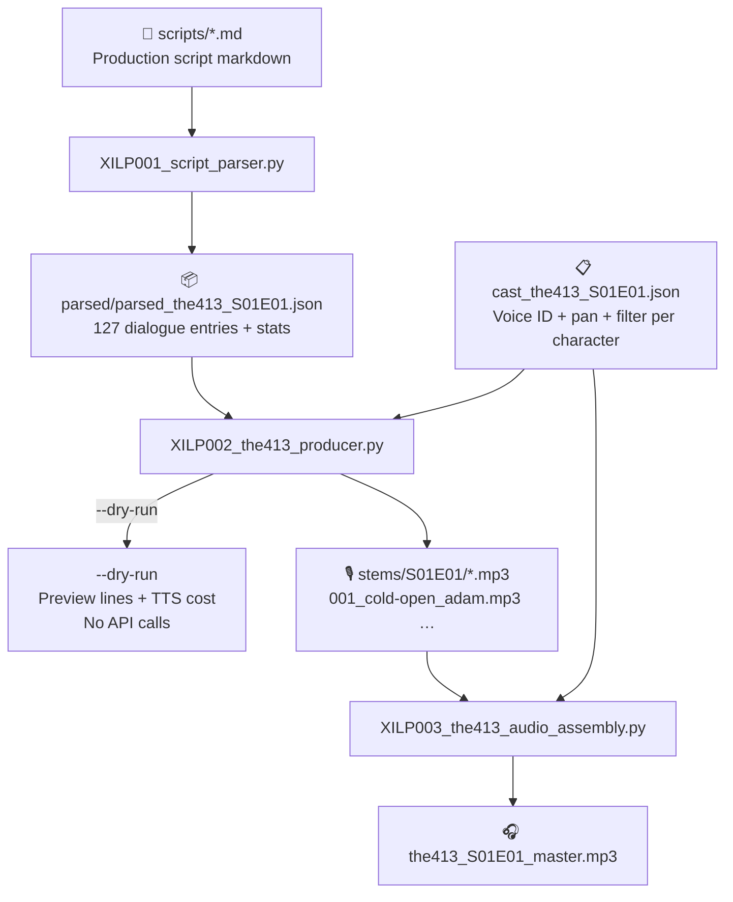
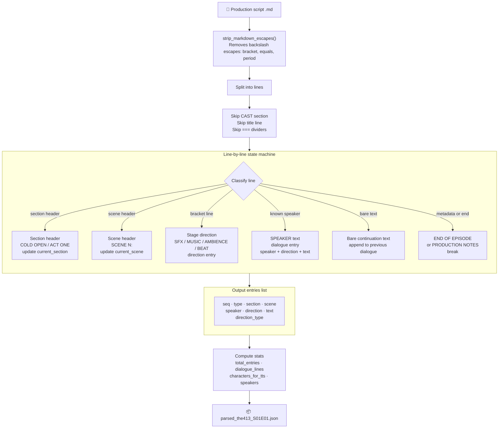
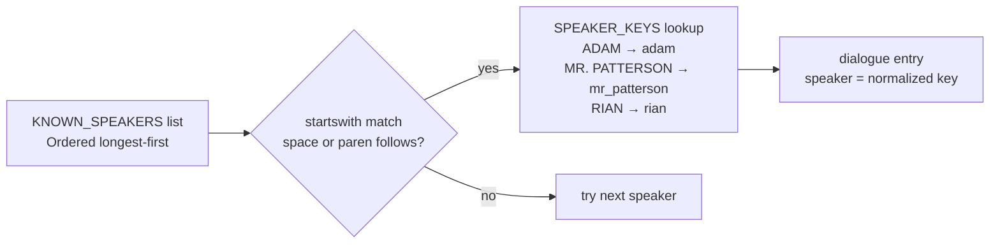
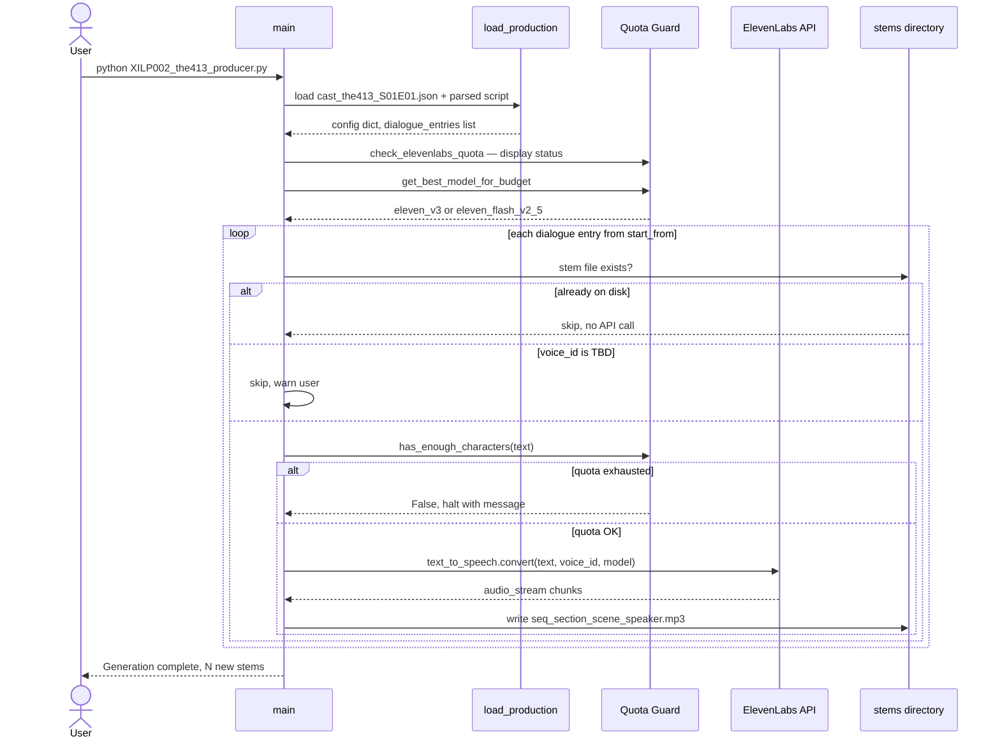
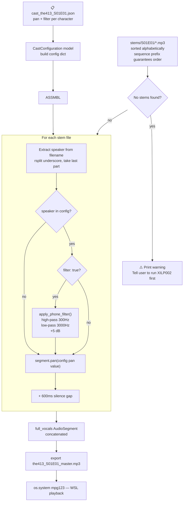
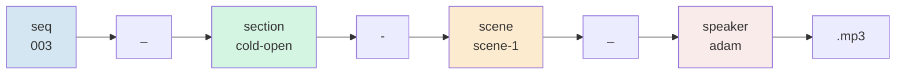
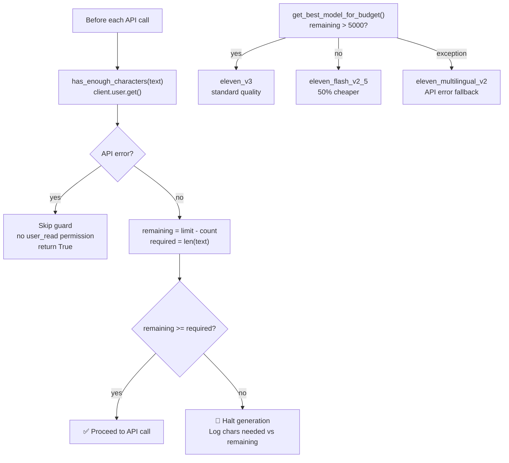

# XILP Pipeline Diagrams

Documentation of the three-script automated podcast production pipeline for **THE 413**.

---

## 1. End-to-End Overview

---

## 2. XILP001 — Script Parser Internals

### Speaker normalization

---

## 3. XILP002 — Voice Generation

---

## 4. XILP003 — Audio Assembly

> **Restartability:** XILP003 has no ElevenLabs dependency and reads only `cast_the413_S01E01.json` and
> the `stems/<TAG>/` directory. Re-running assembly after adjusting effects or adding missing stems
> requires no API key and carries no TTS quota risk.

---

## 5. Stem File Naming Convention

**Example:** `003_cold-open_adam.mp3`, `028_act1-scene-1_rian.mp3`, `102_act2-scene-5_mr_patterson.mp3`

---

## 6. API Cost Guard Flow

