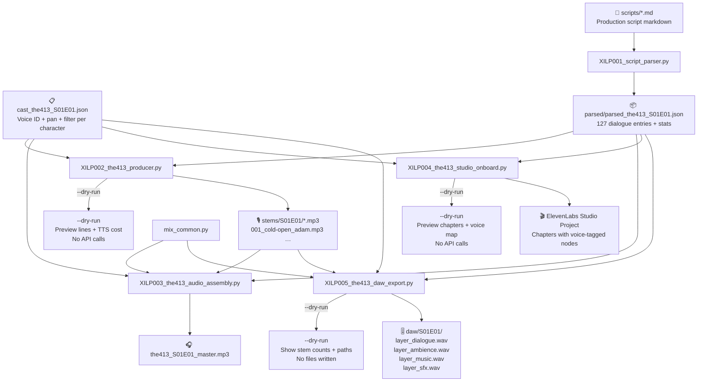
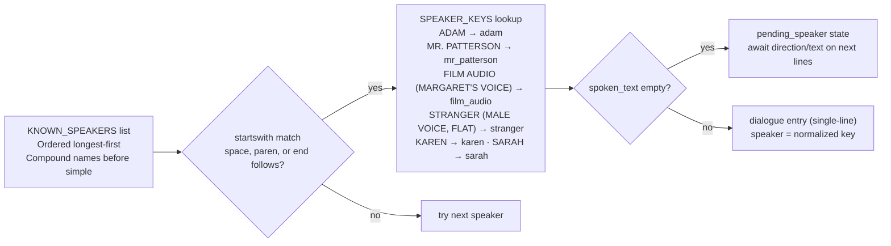
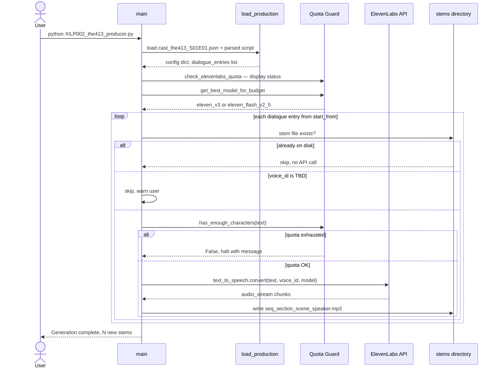
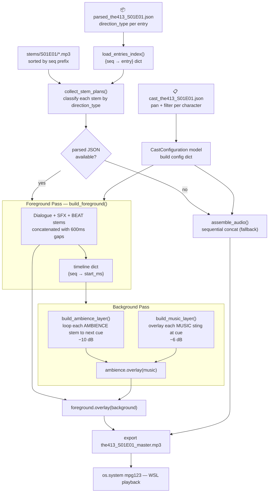
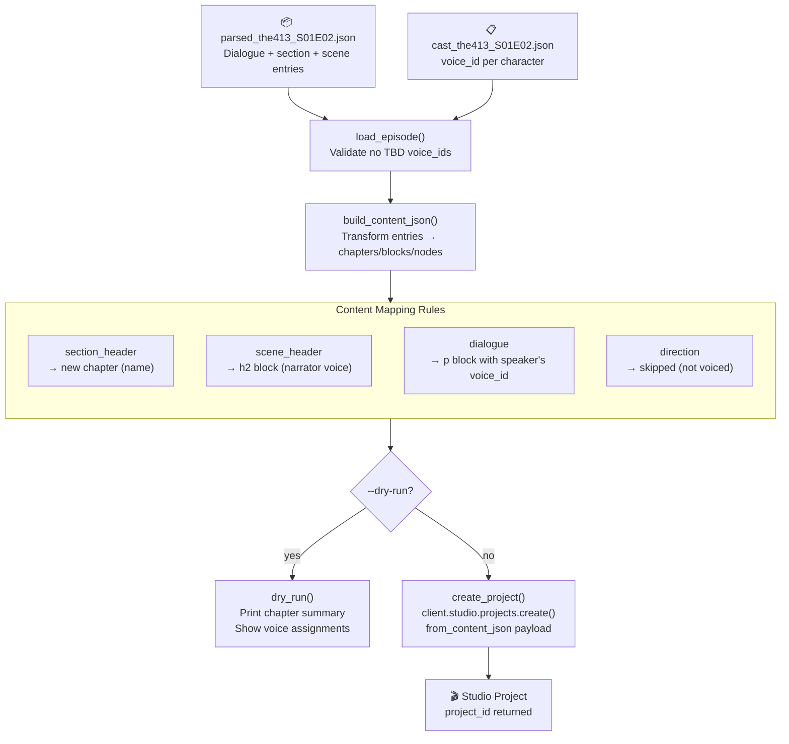
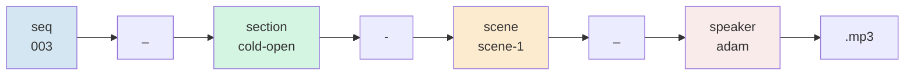
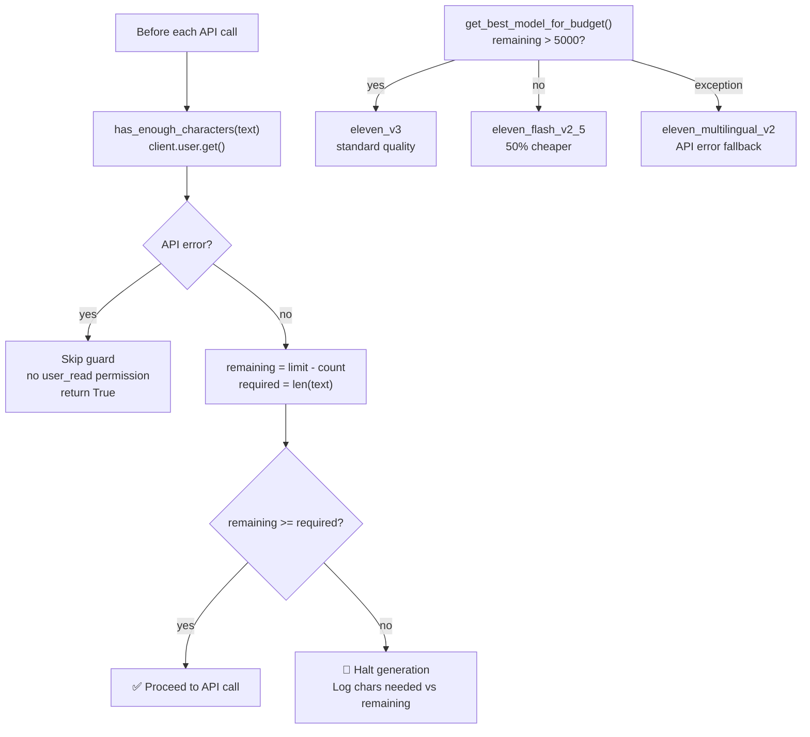
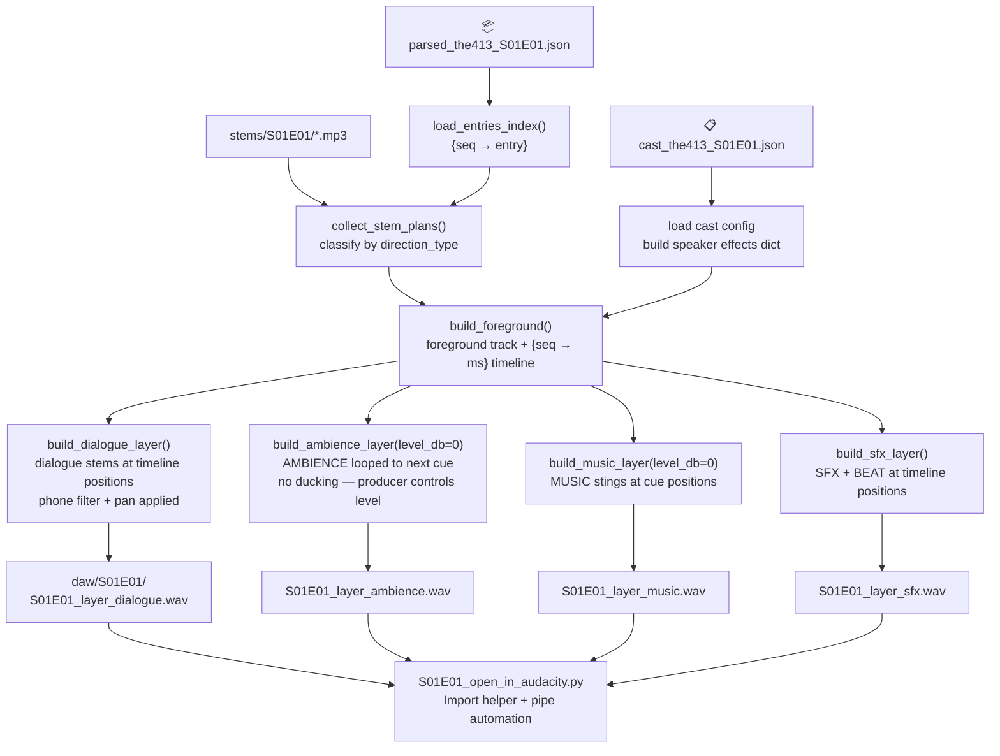

# XILP Pipeline Diagrams

Documentation of the five-stage automated podcast production pipeline for **THE 413**.

---

## 1. End-to-End Overview

---

## 2. XILP001 — Script Parser Internals

```mermaid
flowchart TD
    IN["📄 Production script .md"]
    ESC["`strip_markdown_escapes()
    Removes backslash escapes: bracket, equals, period`"]
    FMT["`strip_markdown_formatting()
    Removes ## headings, **bold**, trailing breaks`"]
    LINES["Split into lines"]
    SKIP["`Skip CAST section
    Skip title line
    Skip === / --- dividers`"]

    LINES --> SKIP --> LOOP

    subgraph LOOP["Line-by-line state machine"]
        direction TB
        PEND{"`pending_speaker?
        multi-line dialogue`"}
        PDIR["`(direction) line
        update pending direction`"]
        PTXT["`Spoken text line
        create dialogue entry`"]
        CHK{"Classify line"}
        SEC["`Section header
        COLD OPEN / OPENING CREDITS / ACT ONE
        update current_section`"]
        SCN["`Scene header
        SCENE N:
        update current_scene`"]
        DIR["`Stage direction
        SFX / MUSIC / AMBIENCE / BEAT
        direction entry`"]
        DLG["`SPEAKER text
        dialogue entry (single-line)
        or set pending_speaker (multi-line)`"]
        CONT["`Bare continuation text
        append to previous dialogue
        filter standalone (parentheticals)`"]
        STOP["`END OF EPISODE
        END OF PRODUCTION SCRIPT
        or PRODUCTION NOTES — break`"]

        PEND -->|"(dir)"| PDIR
        PEND -->|text| PTXT
        CHK -->|section header| SEC
        CHK -->|scene header| SCN
        CHK -->|bracket line| DIR
        CHK -->|known speaker| DLG
        CHK -->|bare text| CONT
        CHK -->|metadata or end| STOP
    end

    IN --> ESC --> FMT --> LINES
    LOOP --> ENTRIES

    subgraph ENTRIES["Output entries list"]
        direction LR
        E1["`seq · type · section · scene
        speaker · direction · text
        direction_type`"]
    end

    ENTRIES --> STATS["`Compute stats
    total_entries · dialogue_lines
    characters_for_tts · speakers`"]
    STATS --> JSON["📦 parsed_the413_S01E01.json"]
```

### Speaker normalization

---

## 3. XILP002 — Voice Generation

---

## 4. XILP003 — Audio Assembly (Two-Pass Multi-Track Mix)

> **Restartability:** XILP003 has no ElevenLabs dependency. Re-running assembly after adjusting
> effects or adding missing stems requires no API key and carries no TTS quota risk.

---

## 5. XILP004 — Studio Project Onboarding

> **Speaker-name problem solved:** Each `tts_node` carries its own `voice_id` — speaker names
> never appear in the text, so TTS won't voice them. No manual post-creation cleanup needed.

---

## 6. Stem File Naming Convention

**Example:** `003_cold-open_adam.mp3`, `028_act1-scene-1_rian.mp3`, `102_act2-scene-5_mr_patterson.mp3`

---

## 7. API Cost Guard Flow

---

## 8. XILP005 — DAW Layer Export

> **Audacity alignment:** All four WAV files are exactly the same duration (full episode length).
> Importing them into Audacity at t=0 produces four perfectly aligned tracks — no repositioning
> or time-offset metadata required. Run `python S01E01_open_in_audacity.py` for import instructions.
